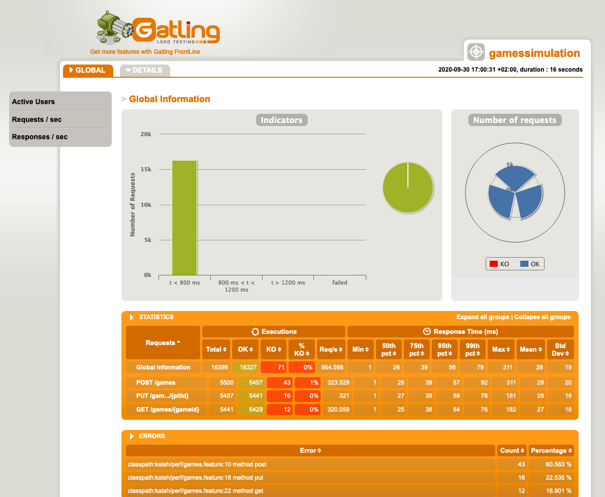

# Kalah Performance Test

### Setup
* Users: 5500
* Time period: 10 sec
* Hardware: 
    * Processor: 2,9 GHz 6-Core Intel Core i9
    * Memory: 32 GB 2400 MHz DDR4
    * 500GB Flash Disk

### Results

    

### Analysis

1. The system as a whole can handle around 585 requests per second with a failure rate of 1% for 5500 concurrent users 
over a period of 10 seconds.

2. The operation to create a game tends to degrade faster than others (i.e: when the level of concurrent users increases 
the rate of failure is higher), however to notice that given the nature of the game, 
the users will more likely be using the retrieval operations more intensively which can handle more request before 
reaching breaking point.

3. The response times tend to be around ~50ms in average for all operations, the worst cases are around 100ms for the 
99th percentile.
If the app uses a real DBMS (not in-memory h2), it would be advisable to measure the impact of the new topology.

### Resources

* [Gatling Report generated](/reports/gamessimulation-20200930182745872/index.html)
* [Karate Test Automation](https://intuit.github.io/karate/karate-gatling/)